<p align="center">
  <a href="https://kosmos.fyi">
    
  </a>
</p>

started a company. [kosmos](https://kosmos.fyi) is an always-on intelligence and agentic trading layer for prediction markets: agents that read everything, explain why prices move, and trade on what they find. while you sleep, preferably.

bloomberg built the layer between traders and securities, and the terminal became worth more than most of the exchanges it quotes. prediction markets don't have that layer yet. we're building it.

math + cs @ uiuc in the background. i write about prediction markets [here](https://www.mahirsabharwal.com/blog).

<br>

```
mahir@kosmos ~ % cat book.txt

 ID    POSITION                ENTRY       STATUS
 001   kosmos, co-founder      APR 2026    LONG 50x leverage
 002   b.s. math + cs, uiuc    AUG 2023    hold to maturity
```

<p align="center">
  
</p>

<p align="center">
  <samp>
    <a href="https://www.mahirsabharwal.com">site</a> .
    <a href="https://www.mahirsabharwal.com/blog">blog</a> .
    <a href="https://kosmos.fyi">kosmos</a> .
    <a href="https://linkedin.com/in/Mahirsabharwal">linkedin</a> .
    <a href="mailto:mahirsabharwal@kosmos.fyi">email</a>
  </samp>
</p>
